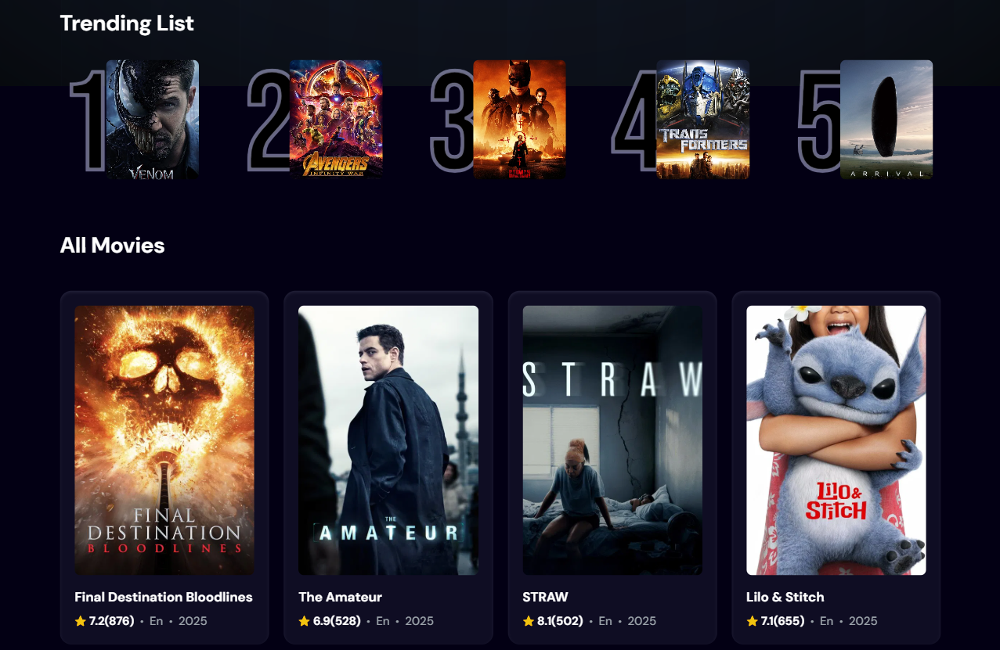
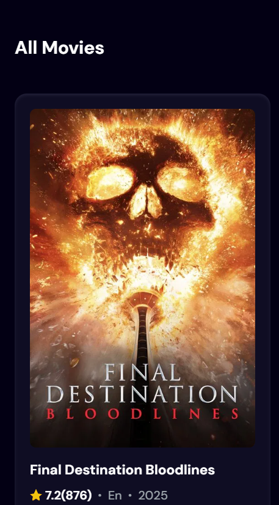

# Movie Search App 🎬

A React-based web application for discovering and searching movies using the TMDB API, with trending movie tracking powered by Appwrite.

## 📸 Screenshots

### Homepage


### Trending Movies and All Movies Section


### Mobile Responsive View



## ✨ Features

- **🔍 Movie Search**: Search for any movie using the TMDB API
- **📈 Trending Movies**: Tracks and displays the top 5 most searched movies
- **⏱️ Debounced Search**: Optimized search with 1-second debounce
- **📱 Responsive Design**: Works on mobile and desktop devices
- **🎨 Modern UI**: Clean interface with attractive gradients and animations

## 🛠️ Technologies Used

- **Frontend**: 
  - React 19
  - Tailwind CSS
  - Vite

- **Backend Services**:
  - TMDB API (for movie data)
  - Appwrite (for tracking search trends)

## 🚀 Installation

1. Clone the repository:
   ```bash
   git clone https://github.com/Nipuna-Heshan/movie-app.git
   cd movie-app
   ```
2. Install dependencies:
  ```bash
  npm install
  ```
3. Set up environment variables:
  - Create a .env file in the root directory with:
  ```bash
  VITE_TMDB_API_KEY=your_tmdb_api_key
  VITE_APPWRITE_ENDPOINT=your_appwrite_endpoint
  VITE_APPWRITE_PROJECT_ID=your_appwrite_project_id
  VITE_APPWRITE_DATABASE_ID=your_appwrite_database_id
  VITE_APPWRITE_COLLECTION_ID=your_appwrite_collection_id
  ```
4. Run the development server:
  ```bash
  npm run dev
  ```
## 🔌 API Usage
- The app uses two main APIs:

1. TMDB API:
  - Used for fetching movie data and search results
  - Requires an API key from TMDB
2. Appwrite:
  - Used to track search terms and display trending movies
  - Requires an Appwrite project setup

## 📜 Available Scripts
- Starts the development server
```bash
npm run dev
```
- Builds the app for production
```bash
 npm run build
 ```
- Runs ESLint to check for code issues
```bash
npm run lint
```
- Previews the production build
```bash
npm run preview
```

## 📄 License
- This project is licensed under the MIT License - see the [Link](https://github.com/Nipuna-Heshan/movie-app?tab=MIT-1-ov-file) file for details.
